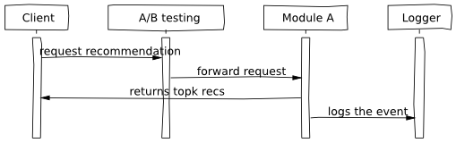
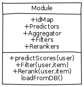
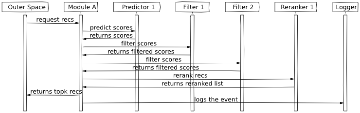

.. _tutorial:

=======================
Tutorial for Developers
=======================

Make a filter
-------------

A filter is a callable class that can be used to implement a business logic to filter out irrelevant recommendations.
Filters are executed after a recommendation model (such as Collaborative Filtering) made user-item utility score predictions.

.. code-block:: python
   :linenos:

   class SomeFilter(object):

        def __call__(self, user, recommendation, size):
            """

            :param user: An recommendation.models.User instance for the user that ask for the recommendation.
            :param recommendation: An numpy.array with shape (n,) being n the number of items in the system.
                The index of the array should represent the id for the item in the database and the value a
                score in witch the recommendation will be evaluated.
            :param size: The size of the recommendation asked.
            """
            for item in user.owned_items:
                recommendation[item.pk-1] = float("-inf")
            return recommendation

.. note::

    The raw recommendation come from `test.fm`_ framework. Test.fm is not aware of data origin or mapping. It just
    receives items from 0 to n and users from 0 to m and delivers a list of scores where the index represent the item.
    In order to make this mapping we use SQL id. It starts in 1 so we must decrement 1 for mapping. The same goes for
    user. The incrementation occurs when turning recommendation index to MySQL ids.

Lets take a look at the filter, which removes items already owned by a user from the recommendation list.
The idea is to take an original scores produced by an algorithm (passed as *recommendation*) and modify them
to fit our needs. In this case, the filter traverses the list of items that the user owns and put the lowest 
possible score for that item instead of the original score. We will recommend items with the highest scores,
therefore, these items will not likely be ever recommended.

After finished implementing the filter it must be registered to the system. 
You should edit settings.py and modify *RECOMMENDATION_SETTINGS* variable by registering the new filter
with the other filters.

.. code-block:: python
   :linenos:

   # settings.py

   RECOMMENDATION_SETTINGS = {
        "default": {
            "core": "recommendation.core.TensorCoFiController",
            "filters": [] if TESTING_MODE else [
                ...
                "some_package.filters.SomeFilter",
                ...
                ],
            "rerankers": [
                ...
            ]
        },
        "logger": "recommendation.simple_logging.decorators.LogEvent"
    }

.. note::

    If your filter is build in a django app and is dependent of a model of that app, you must include the app in
    the installed apps and syncdb or make sure the proper tables exist. The same goes for other django specific like
    middlewares, cache, etc...

.. _test.fm: https://github.com/grafos-ml/test.fm

Overview of the serving system
------------------------------

General Flow
~~~~~~~~~~~~

While implementing recsys serving engine we had to make some architectural choices.
For example, we do on-line recommendation computations instead of precomputing recommendations
for each user and later serving them. This provides flexibility and possibility to include context, 
but limit us on the number of request per second we can serve. Currently we can respond in 
reasonable time for catalogue of 50K items.

Here we want to give an overview of the more tricky parts of the system, so that the developers
could understand them before diving into the code.

The flow diagram above shows the general flow of the information in the frappe system. The Client
(in our case it is someone who uses frappe as a service) asks for a recommendation. Our A/B testing system
selects the module to do recommendations. The Module has predictors, filters and rerankers that
implements core algorithm and business rules around them. Module asks the core algorithm to predict scores
for each item, then asks filters to filter irrelevant recommendations and at the end asks reranker to 
modify scores. The result is returned to the client and is logged to the auditing system.

Module
~~~~~~

A Module is an object that encapsulates most of the functionality of the recommender system. 
It has predictors such as matrix factorisation that computes scores; aggregator combine these scores
into a vector of scores (one score for one app); filters implement
business logic not to show some of the recommendations, such as apps already owned by the user;
reranker finally modifies the ranked list according to some criteria such as diversity.

The flow diagram above shows an example of how a Module processes the
recommendations. We have two predictors that return a vectors of scores, which
are then aggregated (i.e. weighted average) into a single vector of scores.
The filters are fired in a chain just after the aggregator. A reranker is
usually quite expensive to execute and runs last before the result is
returned.

Note, that Module constantly pols the database to check if there are new
models (data used by predictors) available. It loads these models in a background process and swaps
the old models with the new models.

The serving system should be fast, therefore, parts of the code is quite
optimised. We will speak here about optimisations done for the Matrix
Factorisation style recommender
(http://sifter.org/~simon/journal/20061211.html). When using this model,
we get an utility score for a user and an item by computing a dot
product between their representation in a latent space (vectors of
floats).

.. code-block:: python

   :linenos:
	
    import numpy
    item1 = numpy.array([  6.9,   6.9,   2.2])
    user1 = numpy.array([  0.2,   2.2,   0.4]) 
    numpy.dot(user1, item1) #17.44
    
Here the user and item are represented in a 3-dimensional latent space and
the utility score of user1 liking item1 is 17.44. The scores do not mean
a lot by themselves in isolation, but we can tell if the user would like
item1 more than item2 (higher score means bigger utility, more "me like this").
	
Because we want to compute a score for all the items, we multiply user vector with
an item matrix (bunch of vectors). As an output we get a vector of
length the same as the number of items. 

.. code-block:: python
   :linenos:
	
    items = numpy.array([[ 6.9,  6.9,  2.2],
                [ 3.1,  3.1,  3.1],
                [ 0. ,  0. ,  0. ],
                [ 3.1,  3.1,  2.1]])
	
	numpy.dot(items, user1)
	#array([ 17.44,   8.68,   0.  ,   8.28])
	
Here we see that user1 likes an item at position 0 of the array more
than any other item. We do vector matrix multiplication just because it
is about 10x faster than going one item by one item and computing a dot
product. Numpy with CPU level optimisations is really efficient and we
want to harnest that power.

Because we use matrices, we have a technical challenge that the indexes
for apps should start from 0, and better there should be no gaps between
ids (saving memory). It looks simple in the beginning, but gets slightly
more complicated when one considers such scenarios:

1. The item data is dynamic, and some items go away, while others are added. This create problems of gaps within the matrices.
2. We rebuild models (user and item representations) at different frequencies for different models. This can create problems that some model has more items than others.
3. Aggregator averages two scoring vectors, therefore these should be of equal length

Id Map
~~~~~~

Or solution to this problems is the following: First, we store an item model 
as serialised (pickled) python dictionary (see XXX code). We store
user model in the database together with other user information. Usually
we have much more users than items in the system. Therefore, it can be that
user matrix is very big and we can not store it in memory. On the other hand,
we can load user model (or compute it) when a user comes to the system. So if the user
has not been recently using the system, the first request will be non-personalised.
Then we will load or compute a user model and consequent recommendations will be
personalised. In the code block bellow we have an item model as a dictionary:

.. code-block:: python
   :linenos:
	
    #items model1
    {"item1": array([[  6.9,   6.9,   2.2]]),
     "item2": array([[  3.1,   3.1,   3.1]]),
     "item5": array([[  3.1,   3.1,   2.1]])}

This representation occupies up to 3 times more space in a relational database than saving
just an float array as BLOB, however, we get simplicity and flexibility of having item
ids as they appear in the system.

Each Module loads all the arrays for each of the predictors into memory.
Imagine we have two models that we want to use for a prediction. The one
displayed above ("item1", "item2", "item5") and another one:

.. code-block:: python
   :linenos:
   
    #items model2
    {"item1": array([[  0.9,   0.9,   0.2]]),
     "item3": array([[  0.1,   0.1,   0.1]])}

Next, it constructs a single one-to-one IdMap that maps these string ids, to an internal
integer id. This internal id represents a row in the matrix. In our case we would have a
double dictionary mapping:

.. code-block:: python
   :linenos:
   
	{"item1" : 0, "item2": 1, "item3": 2, "item5": 3}
	{0: "item1", 1: "item2", 2: "item3", 3: "item5"}
	
We need double map as we will have to go from row ids to item ids and back in various parts of the code.
For each of the predictor we construct an item matrix using the IdMap:

.. code-block:: python
   :linenos:

    #items of model1
    array([[ 6.9,  6.9,  2.2],
       [ 3.1,  3.1,  3.1],
       [ 0. ,  0. ,  0. ],
       [ 3.1,  3.1,  2.1]])
       
    #items of model2
    array([[ 0.9,  0.9,  0.2],
       [ 0. ,  0. ,  0. ],
       [ 0.1,  0.1,  0.1],
       [ 0. ,  0. ,  0. ]])

If some item is missing in the loaded data ("item3" for model1), we simply put zeros there. 
Now, each Module contains consistent IdMap for all the predictors within the Module. 
Next, module constructs filters and rerankers using the same IdMap that also are unique for each Module.

